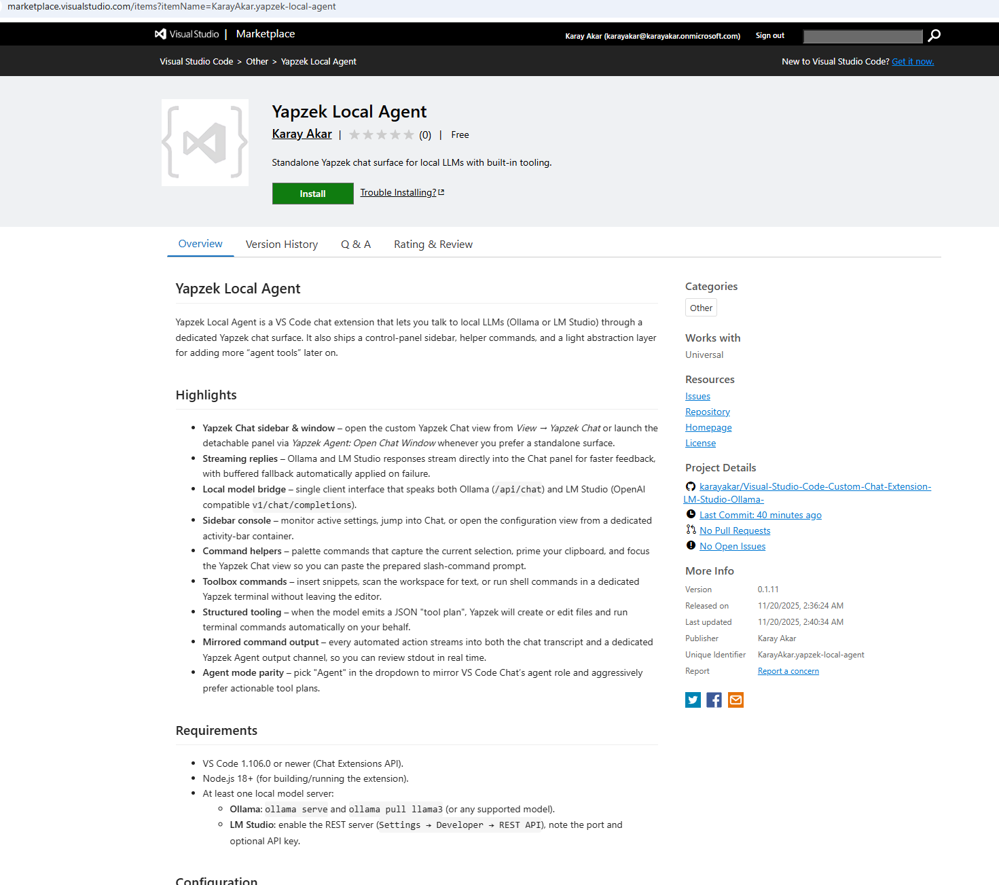
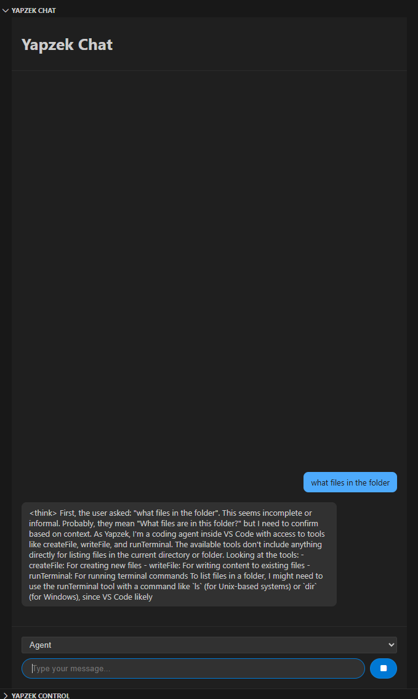
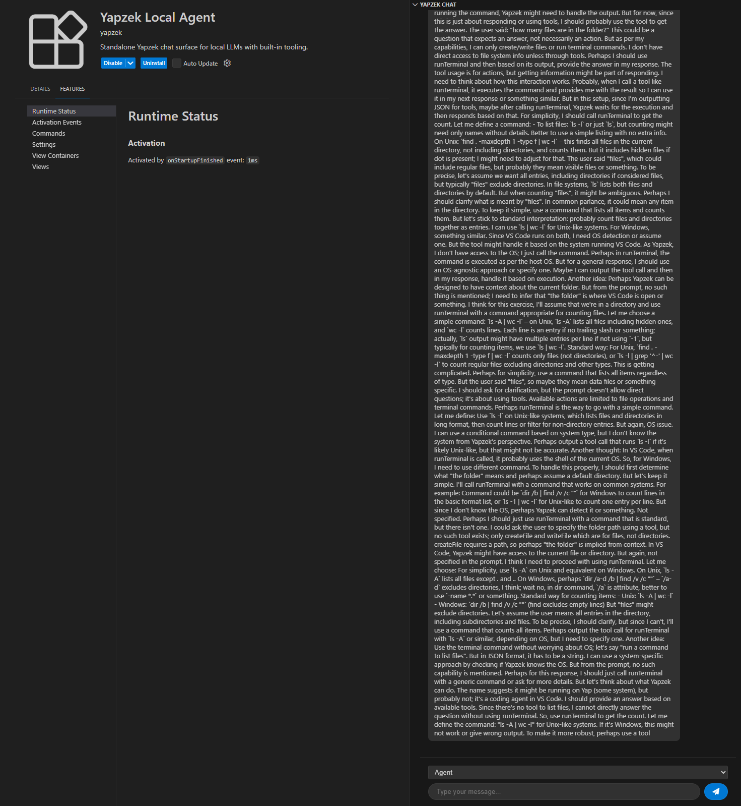
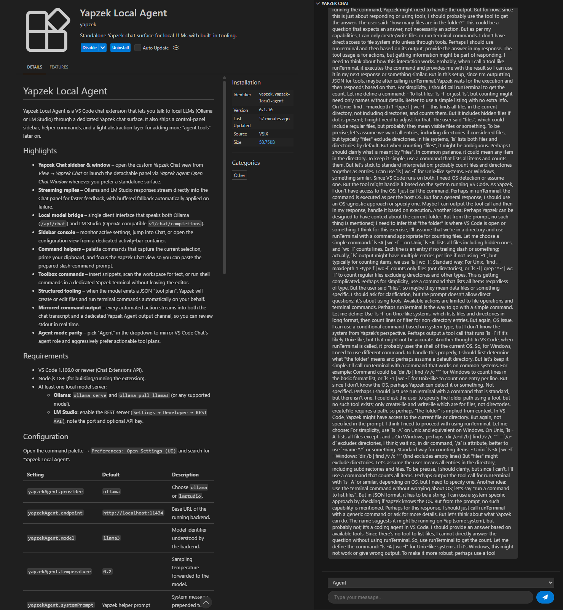
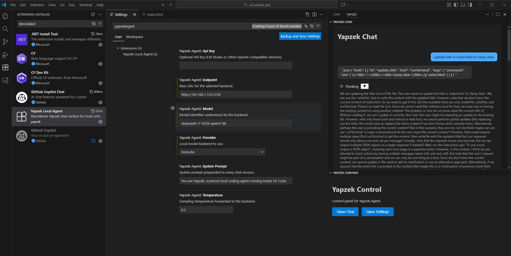

# Yapzek Local Agent

Yapzek Local Agent is a VS Code chat extension that lets you talk to local LLMs (Ollama or LM Studio) through a dedicated Yapzek chat surface. It also ships a control-panel sidebar, helper commands, and a light abstraction layer for adding more “agent tools” later on.

<p align="center">
  
</p>


## Highlights

- **Yapzek Chat sidebar & window** – open the custom Yapzek Chat view from *View → Yapzek Chat* or launch the detachable panel via *Yapzek Agent: Open Chat Window* whenever you prefer a standalone surface.
- **Streaming replies** – Ollama and LM Studio responses stream directly into the Chat panel for faster feedback, with buffered fallback automatically applied on failure.
- **Local model bridge** – single client interface that speaks both Ollama (`/api/chat`) and LM Studio (OpenAI compatible `v1/chat/completions`).
- **Sidebar console** – monitor active settings, jump into Chat, or open the configuration view from a dedicated activity-bar container.
- **Command helpers** – palette commands that capture the current selection, prime your clipboard, and focus the Yapzek Chat view so you can paste the prepared slash-command prompt.
- **Toolbox commands** – insert snippets, scan the workspace for text, or run shell commands in a dedicated Yapzek terminal without leaving the editor.
- **Structured tooling** – when the model emits a JSON "tool plan", Yapzek will create or edit files and run terminal commands automatically on your behalf.
- **Mirrored command output** – every automated action streams into both the chat transcript and a dedicated Yapzek Agent output channel, so you can review stdout in real time.
- **Agent mode parity** – pick "Agent" in the dropdown to mirror VS Code Chat’s agent role and aggressively prefer actionable tool plans.


## Screenshots

<p align="center">
  
</p>

<p align="center">
  
</p>

<p align="center">
  
</p>

<p align="center">
  
</p>


## Requirements

- VS Code 1.106.0 or newer (Chat Extensions API).
- Node.js 18+ (for building/running the extension).
- At least one local model server:
  - **Ollama**: `ollama serve` and `ollama pull llama3` (or any supported model).
  - **LM Studio**: enable the REST server (`Settings → Developer → REST API`), note the port and optional API key.

## Configuration

Open the command palette → `Preferences: Open Settings (UI)` and search for “Yapzek Local Agent”.

| Setting | Default | Description |
| --- | --- | --- |
| `yapzekAgent.provider` | `ollama` | Choose `ollama` or `lmstudio`. |
| `yapzekAgent.endpoint` | `http://localhost:11434` | Base URL of the running backend. |
| `yapzekAgent.model` | `llama3` | Model identifier understood by the backend. |
| `yapzekAgent.temperature` | `0.2` | Sampling temperature forwarded to the model. |
| `yapzekAgent.systemPrompt` | Yapzek helper prompt | System message prepended to every chat turn. |
| `yapzekAgent.apiKey` | _empty_ | Optional bearer token (mainly for LM Studio or OpenAI-compatible proxies). |

## Usage

1. Start your preferred local model backend and confirm it answers REST calls.
2. Open the Yapzek Chat sidebar via **View → Yapzek Chat** or run **Yapzek Agent: Open Chat Sidebar** / **Yapzek Agent: Open Chat Window** from the Command Palette for a floating panel.
3. Use the helper commands from the palette to prefill prompts:
	- **Yapzek Agent: Explain Selection**
	- **Yapzek Agent: Refactor Selection**
	- **Yapzek Agent: Generate Tests**
	- **Yapzek Agent: Insert Snippet** (paste model output directly at the cursor)
	- **Yapzek Agent: Workspace Search** (jump to the next file containing a literal string)
	- **Yapzek Agent: Run Terminal Command** (send text to a dedicated terminal session)

Each helper copies the prepared text to your clipboard and focuses the Yapzek Chat view so you can paste it right away.

### Custom Yapzek chat view

The dedicated sidebar/panel replicates the core VS Code Chat experience with a few extras:

- Dropdown mode selector (`Ask`, `Explain`, `Refactor`, `Test`) that maps to Yapzek’s slash commands.
- Toggle to include the current selection or file context with every turn.
- Streaming transcript with cancel/clear controls plus quick access to the Yapzek settings page.

Everything flows through this standalone surface—no @-mention or native Chat integration is required.

### Tool automation

Yapzek now supports structured "tool plans" so the model can launch commands or edit files safely:

````json
```json
{
	"explanation": "Add unit tests and verify formatting",
	"actions": [
		{ "tool": "writeFile", "id": "edit-tests", "path": "src/foo.test.ts", "contents": "// updated tests" },
		{ "tool": "runTerminal", "id": "run-tests", "command": "npm run test" }
	]
}
```
````

- Wrap the plan in a single ```json block.
- Paths are always workspace-relative.
- Use `createFile` for brand new files; use `writeFile` for edits (set `append` or `overwrite` flags as needed).
- `runTerminal` commands should be non-interactive (npm/yarn/pnpm scripts work best).
- Omit the plan entirely if you’re only providing an explanation and no automated steps are required.
- Yapzek injects these TOOL PLAN instructions into both the system and user prompts so compliant models know exactly how to respond. Non-compliant replies simply act as analysis with no actions executed.
- Automated actions now ship with live stdout/stderr mirroring in the **Yapzek Agent** output channel plus a compact summary message in the transcript so you always see what ran, what succeeded, and what needs attention.

## Developing & Testing

```powershell
npm install
npm run watch
```

- Press `F5` (or run the “Launch Extension” configuration) to start a new Extension Development Host.
- Inside the test window, open the Yapzek Agent view from the activity bar and start chatting with the participant.

Run a one-off type-check/build (plus lint) before publishing:

```powershell
npm run compile
npm run lint
```

## Packaging & Distribution

The project bundles `vsce` as a dev dependency so you can produce VSIX artifacts locally:

```powershell
npm run package
```

This command creates `yapzek-local-agent-x.y.z.vsix` in the workspace root. Share it directly or install it via the VS Code command palette (`Extensions: Install from VSIX...`).

## Roadmap / Known Gaps

- Add markdown rendering (and copy buttons) to the transcript to improve long-form replies.
- Expand the toolbox to cover diff-aware edits, rename/copy operations, and smarter workspace search.
- Wire up packaged release automation (CI workflow plus signed VSIX artifacts).

Contributions and ideas are welcome—open an issue or start a discussion once the repo is published."# Visual-Studio-Code-Custom-Chat-Extension-LM-Studio-Ollama-" 
